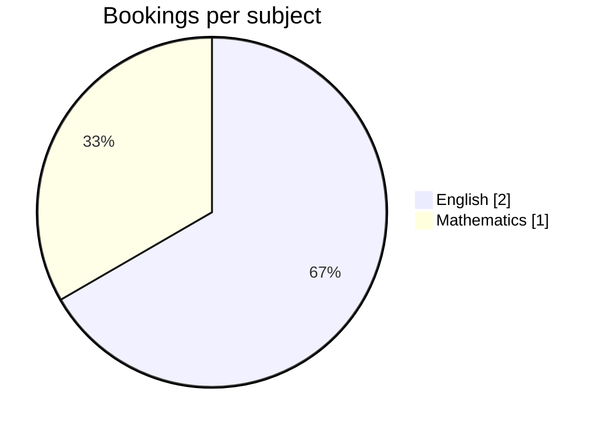
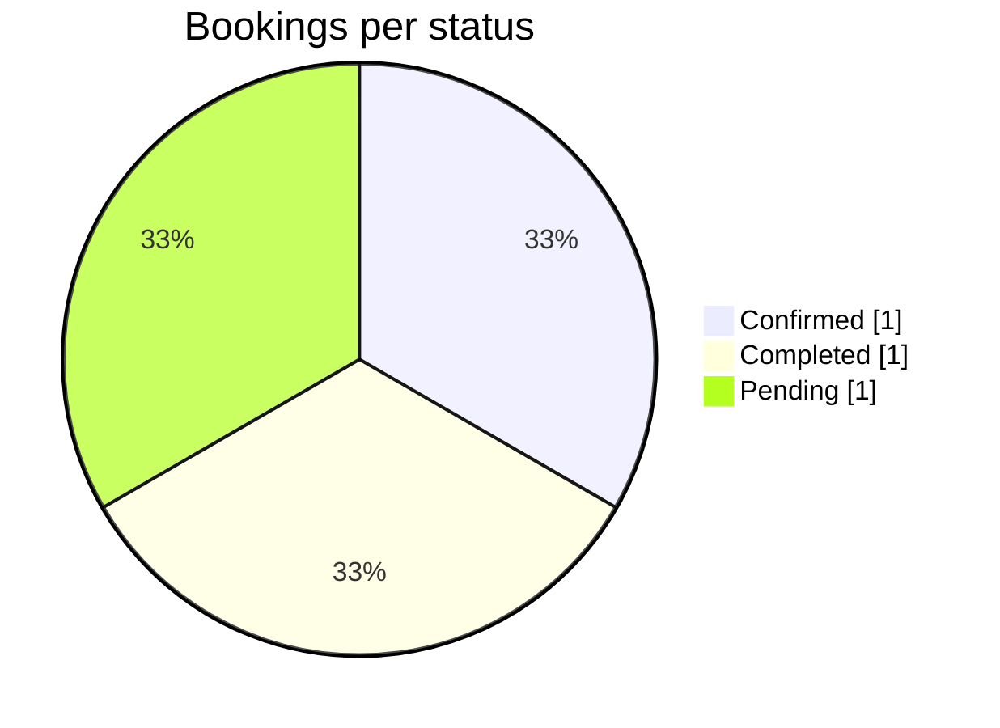
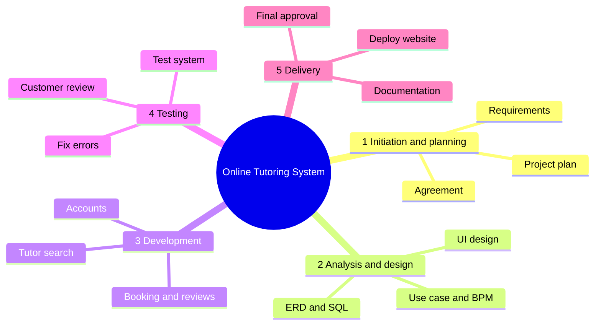
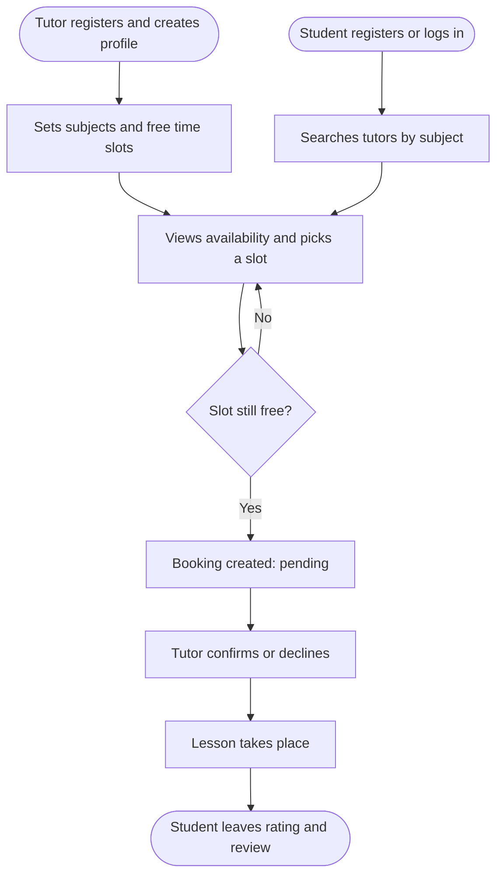
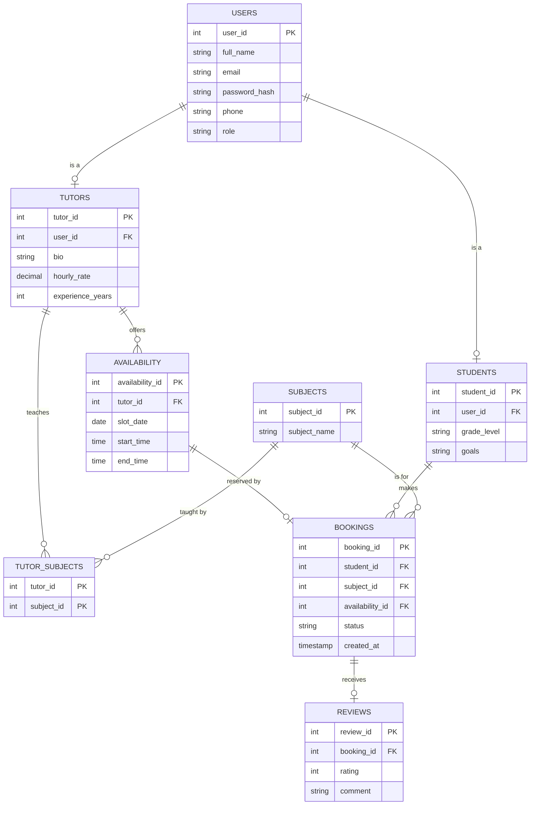

# 📊 Project Plan: Online Tutoring Management System

**Course:** IT Project Management
**University:** Ajou University in Tashkent (AUT)
**Presentation:** 15 October 2026

---

## 👥 1. Team Information

**Team Name:** 404

| Role | Name | Student ID | Group |
|---|---|---|---|
| Leader | Baxtiyorova Shohinabonu | 202490400 | I24A |
| Member | Karimova Lola | 202490162 | I24A |
| Member | Muslimova Diyora | 202490916 | I24A |

**Roles:** Shohinabonu is the Team Leader, Diyora is the Project Planner, and Lola is the customer representative.

---

## 📌 2. Project Title & Overview

**Project Title:** Online Tutoring Management System: Data Analysis of Tutor Search and Lesson Bookings

This project plans and designs a website where students find tutors by subject, view their free time slots and book lessons, and tutors manage their subjects, availability and bookings. We then analyze the project's own database with Pandas to study which subjects, tutors and time slots are used the most.

---

## 📊 3. Dataset Information

- **Dataset Title:** Online Tutoring Database (8 tables)
- **Source:** Created by our team. It is the sample data of our own SQL database, exported to CSV (full data is shown below).
- **Description:** Users and roles, tutor hourly rates, subjects, tutor time slots, bookings with a status, and student reviews (1 to 5 stars).
- **Why Selected:** It comes straight from our project, so the analysis answers real questions about the system. It also has several linked tables, which is good practice for merging and grouping in Pandas.
- **Size:** 8 tables. The merged analysis table has 3 rows (one per booking), a small sample that grows with real use.

<details>
<summary>Rows and columns per table</summary>

| Table | Rows | Columns |
|---|---|---|
| `users` | 3 | 4 |
| `students` | 1 | 3 |
| `tutors` | 2 | 4 |
| `subjects` | 4 | 2 |
| `tutor_subjects` | 3 | 2 |
| `availability` | 4 | 5 |
| `bookings` | 3 | 5 |
| `reviews` | 1 | 3 |

</details>

<details>
<summary>The data (CSV content of each table)</summary>

**users.csv**
```csv
user_id,full_name,email,role
1,Aziz Rakhimov,aziz@mail.uz,student
2,Dilnoza Yusupova,dilnoza@mail.uz,tutor
3,Jasur Tursunov,jasur@mail.uz,tutor
```

**students.csv**
```csv
student_id,user_id,grade_level
1,1,Grade 11
```

**tutors.csv**
```csv
tutor_id,user_id,hourly_rate,experience_years
1,2,80000,5
2,3,60000,3
```

**subjects.csv**
```csv
subject_id,subject_name
1,English
2,Mathematics
3,Physics
4,Programming
```

**tutor_subjects.csv**
```csv
tutor_id,subject_id
1,1
2,2
2,3
```

**availability.csv**
```csv
availability_id,tutor_id,slot_date,start_time,end_time
1,1,2026-10-05,10:00:00,11:00:00
2,1,2026-10-05,11:00:00,12:00:00
3,2,2026-10-06,15:00:00,16:00:00
4,2,2026-10-07,15:00:00,16:00:00
```

**bookings.csv**
```csv
booking_id,student_id,subject_id,availability_id,status
1,1,1,1,confirmed
2,1,2,3,completed
3,1,1,2,pending
```

**reviews.csv**
```csv
review_id,booking_id,rating
1,2,5
```

</details>

---

## 🎯 4. Project Objectives

**Problem Statement:** How can an online tutoring platform help students find a suitable tutor and book lessons quickly, and help tutors manage their schedules?

**Research Questions:**
1. Which subjects are booked the most?
2. How are bookings divided by status (pending, confirmed, completed, cancelled)?
3. How many of the tutors' time slots are booked?
4. Which tutors have the best average rating?
5. How much income do completed lessons generate?

**Expected Insights:** Popular subjects, busy and idle tutors, how many bookings wait for confirmation, and how well the offered time slots match student demand.

---

## 🛠 5. Data Preparation (Using Pandas)

Data preparation and cleaning steps performed to ensure high data quality:

```python
import pandas as pd

# Load dataset (one CSV file per database table)
users = pd.read_csv("users.csv")
tutors = pd.read_csv("tutors.csv")
subjects = pd.read_csv("subjects.csv")
availability = pd.read_csv("availability.csv")
bookings = pd.read_csv("bookings.csv")
reviews = pd.read_csv("reviews.csv")

# 1. Check missing values and duplicates (result: 0 and 0)
print(bookings.isnull().sum().sum(), bookings.duplicated().sum())

# 2. Convert dates and times to datetime
availability["slot_date"] = pd.to_datetime(availability["slot_date"])
availability["start_time"] = pd.to_datetime(availability["start_time"], format="%H:%M:%S")
availability["end_time"] = pd.to_datetime(availability["end_time"], format="%H:%M:%S")

# 3. Create new features
availability["duration_hours"] = (availability["end_time"] - availability["start_time"]).dt.total_seconds() / 3600
availability["weekday"] = availability["slot_date"].dt.day_name()

# 4. Merge all tables into one analysis table (one row per booking)
tutor_info = tutors.merge(users[["user_id", "full_name"]], on="user_id").rename(columns={"full_name": "tutor"})
df = (bookings
      .merge(availability, on="availability_id")
      .merge(tutor_info[["tutor_id", "tutor", "hourly_rate"]], on="tutor_id")
      .merge(subjects, on="subject_id")
      .merge(reviews[["booking_id", "rating"]], on="booking_id", how="left"))
df["lesson_price"] = df["hourly_rate"] * df["duration_hours"]
```

---

## 🔍 6. Data Analysis Tasks (Using Pandas)

```python
# Bookings per subject, sorted
df.groupby("subject_name")["booking_id"].count().sort_values(ascending=False)

# Bookings per status
df["status"].value_counts()

# Pivot table: subject x status
pd.pivot_table(df, index="subject_name", columns="status",
               values="booking_id", aggfunc="count", fill_value=0)

# Average rating per tutor
df.groupby("tutor")["rating"].mean()

# Income from completed lessons
df[df["status"] == "completed"]["lesson_price"].sum()

# Slot utilization per tutor
slots = (availability
         .merge(bookings[["availability_id"]].assign(booked=1), on="availability_id", how="left")
         .fillna({"booked": 0}))
slots.groupby("tutor_id")["booked"].agg(["sum", "count", "mean"])
```

**Answers:**

| # | Question | Answer |
|---|---|---|
| 1 | Most booked subject | **English** (2 bookings), then Mathematics (1) |
| 2 | Bookings by status | 1 confirmed, 1 completed, 1 pending, 0 cancelled |
| 3 | Slot utilization | **75%** (3 of 4 slots). Dilnoza Yusupova 100%, Jasur Tursunov 50% |
| 4 | Best rating | Jasur Tursunov, **5.0**. Dilnoza Yusupova has no reviews yet |
| 5 | Income (completed lessons) | **60,000** (one 1-hour Mathematics lesson) |





| Tutor | Slots booked | Total slots | Utilization |
|---|---|---|---|
| Dilnoza Yusupova | 2 | 2 | 100% |
| Jasur Tursunov | 1 | 2 | 50% |

---

## 💡 7. Key Findings and Insights

- **English** is the most requested subject, and its tutor's slots are fully booked, which shows demand. The platform should invite more English tutors or add slots.
- **Mathematics** still has free slots, so those tutors can be promoted more.
- **One of three bookings is pending.** Tutors need quick reminders so students are not left waiting.
- **Reviews build trust.** Students should be asked to rate every completed lesson.

> ⚠️ These results come from a small sample. They show how the analysis works, not a final conclusion.

---

## 📅 8. Project Timeline

| Week | Activities |
|---|---|
| Week 1 (07 Sep ~ 13 Sep) | Dataset search and project planning: requirements, project agreement, WBS |
| Week 2 (14 Sep ~ 20 Sep) | Data cleaning and preparation: database design (ERD), SQL tables, sample data, loading data in Pandas |
| Week 3 (21 Sep ~ 27 Sep) | Data analysis and visualization: Pandas analysis, charts, use case diagram and BPM |
| Week 4-5 (28 Sep ~ 13 Oct) | Report writing and presentation preparation |

**Presentation:** 15 October 2026

---

## 🏆 9. Outcome of the Project

**What we learned:** planning an IT project (agreement, WBS, schedule), modeling a system (use case diagram, BPM, ERD), building a relational database in SQL, and working as a team with clear roles.

**Pandas skills developed:** loading CSV files, checking missing values and duplicates, converting data types, creating new columns, merging several tables, grouping, sorting, pivot tables, aggregation, and explaining results in plain language.

---

## ✅ 10. Conclusion

We planned and designed an online tutoring system where students search tutors by subject, view availability and book lessons, and tutors manage their subjects, time slots and bookings. Pandas analysis of the project database showed which subjects and tutors are most used and how well the time slots are filled. The project connects project management, database design and data analysis in one real example, and the same analysis can grow with more data.

---

## 📚 11. References

- Dataset: our own Online Tutoring Database (team project sample data)
- [Pandas documentation](https://pandas.pydata.org/docs/)
- [10 minutes to pandas](https://pandas.pydata.org/docs/user_guide/10min.html)
- [PostgreSQL documentation](https://www.postgresql.org/docs/)
- [Microsoft SQL Server documentation](https://learn.microsoft.com/sql/)
- [Matplotlib documentation](https://matplotlib.org/stable/)

---

## 📎 12. Appendix

### Work Breakdown Structure



### Use cases

| Actor | Use cases |
|---|---|
| Student | Search tutors by subject, book a lesson, view tutor availability, view my schedule, cancel booking, leave review |
| Tutor | Manage subjects, set availability, manage bookings |
| Admin | Manage user accounts, monitor bookings |
| Student and Tutor | Register / log in, manage profile |

### Business process



### Database design (ERD)



A slot can be booked only once: `bookings.availability_id` is `UNIQUE`.
